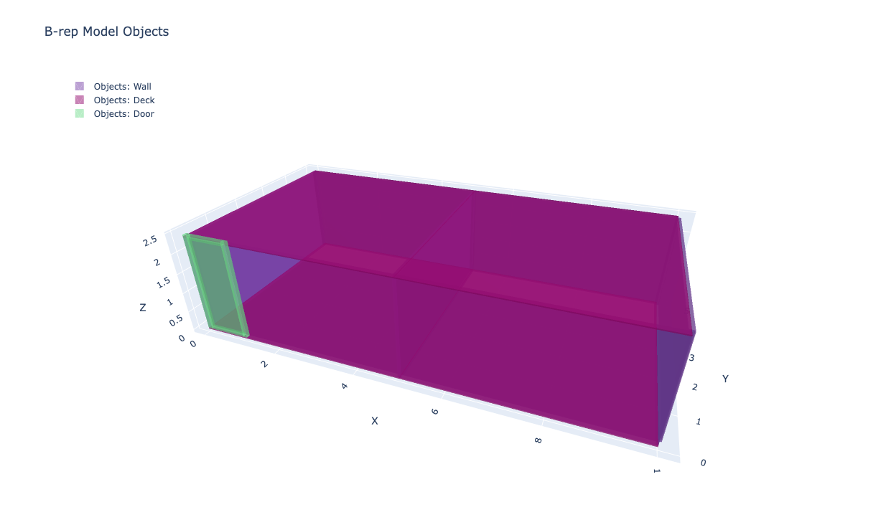

# Demonstrating the Power of Hierarchical Architectural Modeling
### Overview
This document outlines how a hierarchical, object-oriented approach to modeling architecture unlocks critical advantages for data integration, reasoning, and AI-driven workflows. The included code and structure exemplify the concepts discussed in the article on rethinking architectural datasets.
Core Problem in AEC
Traditional AEC tools (Revit, IFC, DWGs, etc.) store architectural data in rigid, disconnected, and file-centric formats. These:

* Resist integration across systems
* Are poorly suited for querying or reasoning
* Encode geometry without semantics
* Impede automation and AI use cases

### A Hierarchical Solution
By building models from first principles—from studs to walls to zones and spaces—we:

* Treat data as computable, not just drawable
* Build from elements to systems
* Enable semantic richness
* Make models queryable and relational

### Demonstration via Code
The included code builds a small architectural system composed of:

`Elements: 2x4 studs, plywood panels, beams`

`Components: Wall assemblies and framed door modules`

`Objects: Walls, decks, and a door`

`Structural Relations: Elements are assembled into higher-level constructs`

The model is instantiated, geometrically reasoned over, and then used to:

* Infer boundaries based on object adjacency and relationships
* Heal and connect misaligned boundaries
* Detect and create closed cycles of boundaries as spaces
* Generate a building graph capturing relationships among objects

```python
    # Using the objects from creating_objects.py + creating_relationships.py

    # Create the model from objects
    model = Model.from_objects(objects)

    # create adjacency relationships in the model
    model.create_adjacency_relationships(tolerance=0.001)

    # infer the boundary objects created by object arangement
    model.infer_bounds()

    # infer the spaces created by boundaries
    model.infer_spaces()

    # view the spaces + objects
    model.show_spaces()
    model.show_objects()
```

### Object View



### Space View


### Benefits Realized
1. Spatial Awareness
The system understands how walls define spaces. Walls are no longer just shapes; they become semantic and spatial boundaries.
2. Topological Reasoning
Using adjacency and geometric alignment, the model infers zones and rooms. This enables:

Space detection
Room volume computation
Adjacency graphs for spatial optimization

3. Semantic Layers
Objects are labeled and typed. A door isn't just a mesh—it's a Door object with a frame, a sheet, swing direction, and spatial context.
4. Full Queryability
Because each item (element, component, object, etc.) exists in a coherent, semantic graph:

You can ask "What is this wall made of?"
You can query: "Which beams support this deck?"
You can reason: "Which walls define the boundary of this space?"

5. AI-Ready Representation
This structure is primed for machine learning and automation:

Spaces can be labeled
Models can be generated
Systems can be simulated

### Conclusion
The combination of code, data structure, and abstraction demonstrates how architectural models can evolve from inert 3D files to intelligent systems.
Architecture isn't just form. It's relationship, system, and function. A hierarchical data model lets us build architecture as a living, computable idea.
This is how we move from files to functions. From drawings to decisions. From models to meaning.